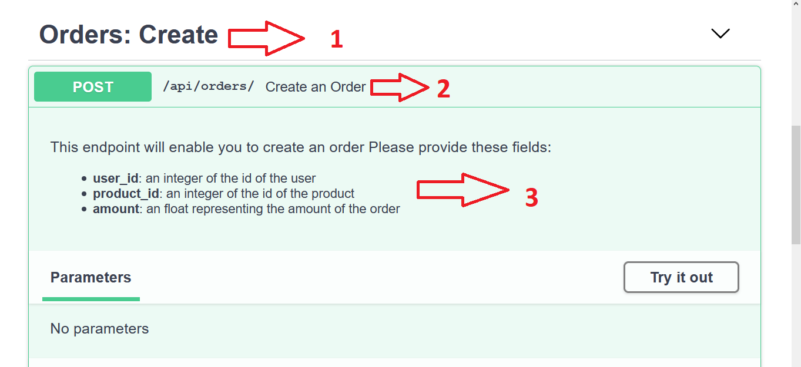
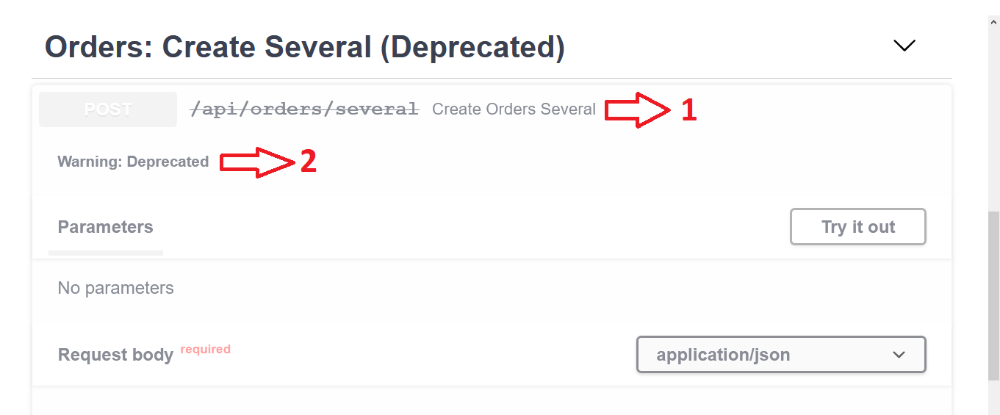

# 2) Django Ninja

## 1) Hello, Ninja!


<b>

```bash
pip install django-ninja
django-admin startproject ninjaApp # Create a django app
cd ninjaApp # Get to the directory
python manage.py makemigrations
python manage.py migrate
python manage.py createsuperuser
winpty python manage.py createsuperuser #Windows
python manage.py runserver
```

</b>

username:admin  
password:admin


<b>

`ninjaApp/urls.py`
```python
from django.contrib import admin
from django.urls import path
from ninja import NinjaAPI

api = NinjaAPI()

@api.get("/add")
def add(request, a: int, b: int):
    return {"result": a + b}

urlpatterns = [
    path("admin/", admin.site.urls),
    path("api/", api.urls),
]
```

</b>

In your browser test this address:

<b>

http://127.0.0.1:8000/api/add?a=1&b=2

</b>

The result will be:
```json
{"result": 3}
```


## 2) Interactive API docs:

In your browser, go to this location:  

<b>
<a href="http://127.0.0.1:8000/api/docs">
http://127.0.0.1:8000/api/docs
</a>
</b>


## 3) API Endpoints:

You need to know what is the **request method**, these are 
examples of the request methods:  
- GET
- POST
- PUT
- DELETE
- Patch
- ...

<b>

```python
@api.get("/path")
def get_operation(request):
    ...
```

</b>


## 4) Path Parameters:

### 4-1) Normal path parameter:

<b>

```python
@api.get("/items/{item_id}")
def read_item(request, item_id):
    return {"item_id": item_id}
```

</b>

### 4-2) Path parameter with specific data type:

<b>

```python
@api.get("/items/{item_id}")
def read_item(request, item_id: int):
    # Here item_id must be convertable to integer
    # It will be validated and sanitized
    return {"item_id": item_id}
```

</b>

If `item_id` can not be converted to integer it will respond 
with such error:
```json
{
    "detail": [
        {
            "loc": [
                "path",
                "item_id"
            ],
            "msg": "value is not a valid integer",
            "type": "type_error.integer"
        }
    ]
}
```


### 4-3) Several path parameters:

<b>

```python
@api.get("/events/{year}/{month}/{day}")
def events(request, year: int, month: int, day: int):
    return {"date": [year, month, day]}
```

</b>

### 4-4) Using Schema with parameters variables:

<b>

```python
import datetime
from ninja import Schema, Path


class PathDate(Schema):
    year: int
    month: int
    day: int

    def value(self):
        return datetime.date(self.year, self.month, self.day)


@api.get("/events/{year}/{month}/{day}")
def events(request, date: PathDate = Path(...)):
    return {"date": date.value()}
```

</b>

Now try this link:  
<b>http://127.0.0.1:8000/api/events/1/1/1</b>  
The output will be:

```json
{
	"date": "0001-01-01"
}
```


## 5) Query Parameters:

### 5-1) How to use query parameters:

<b>

```python
@api.get("/products")
def list_weapons(request, id: int, name: str):
    return {"id":id, "name":name}
```

</b>

When using this link:  
http://127.0.0.1:8000/api/products?id=1&name=abc  
The result will look like this:
```json
{"id": 1, "name": "abc"}
```

### 5-2) Optional query parameters (with default values):

<b>

```python
@api.get("/products")
def list_products(request, id: int = 1, name: str):
    return {"id":id, "name":name}
```

</b>

Now that the **`id`** has a **default value** of **`1`**, 
this means that it is **optional**.


### 5-3) Using Schema:

<b>
Using Pydantic models.

```python
import datetime
from ninja import Schema, Query

class ProductSchema(Schema):
    name: str
    amount: int = 1
    in_stock: bool = True

@api.get("/product")
def product(request, product: ProductSchema = Query(...)):
    return {"product": product.dict()}
```

</b>

If there was any **error**, it will be a **pydantic error**.


## 6) Request body:


<b>
You should use a Schema

```python
from ninja import Schema

class Item(Schema):
    name: str
    description: str = None
    price: float
    quantity: int

@api.post("/items")
def create(request, item: Item):
    return item
```

</b>


Or you can read the **`request.body`** normally.


## 7) Request body, URL parameters and Query parameters:


<b>

```python
from ninja import Schema

class Item(Schema):
    name: str
    description: str = None
    price: float
    quantity: int

@api.post("/items/{item_id}")
def update(request, item_id: int, item: Item, q: str):
    return {"item_id": item_id, "item": item.dict(), "q": q}
```

</b>


<table>
	<tr>
		<th>Field Name</th>
		<th>Interpretation</th>
		<th>Reason</th>
	</tr>
	<tr>
		<td>item_id</td>
		<td>URL Parameter</td>
		<td>It has been already declared in the url parameters</td>
	</tr>
	<tr>
		<td>item</td>
		<td>Request body</td>
		<td>It is a pytdantic schema model, without using 
		the <code>Query</code></td>
	</tr>
	<tr>
		<td>q</td>
		<td>Query parameter</td>
		<td>Single type</td>
	</tr>
</table>


## 8) Form Data:


<b>

```python
from ninja import NinjaAPI, Form

@api.post("/login")
def login(request, username: str = Form(...), 
	password: str = Form(...)):
    return {'username': username, 'password': '*****'}
```

</b>


## 9) File Upload:

<b>

```python
from ninja import NinjaAPI, File
from ninja.files import UploadedFile

# With this endpoint you can upload one file
@api.post("/upload")
def upload(request, file: UploadedFile = File(...)):
    data = file.read()
    return {'name': file.name, 'len': len(data)}


from typing import List

# With this endpoint you can upload several files
@api.post("/upload-many")
def upload_many(request, files: List[UploadedFile] = File(...)):
    return [f.name for f in files]
```

</b>


Each file has the **Django's UploadFile** methods and attributes:
- ``read()``
- ``multiple_chunks(chunk_size=None)``
- ``name``
- ``size``
- ``content_type``
- ect.


## 10) Response Schema:


```python
from ninja import Schema

class UserIn(Schema):
    username: str
    password: str

class UserOut(Schema):
    id: int
    username: str

@api.post("/users/", response=UserOut)
def create_user(request, data: UserIn):
    user = User(username=data.username)
    user.set_password(data.password)
    user.save()
    return user
```

<b>

This line Determines the response schema:
```python
@api.post("/users/", response=UserOut)
```

</b>


## 11) CRUD Example:
The models:
```python
class Department(models.Model):
    title = models.CharField(max_length=100)

class Employee(models.Model):
    first_name = models.CharField(max_length=100)
    last_name = models.CharField(max_length=100)
    department = models.ForeignKey(Department)
    birthdate = models.DateField(null=True, blank=True)
```
The URLs:
```python
from datetime import date
from typing import List
from ninja import NinjaAPI, Schema
from django.shortcuts import get_object_or_404
from employees.models import Employee

api = NinjaAPI()

class EmployeeIn(Schema):
    first_name: str
    last_name: str
    department_id: int = None
    birthdate: date = None

class EmployeeOut(Schema):
    id: int
    first_name: str
    last_name: str
    department_id: int = None
    birthdate: date = None


@api.post("/employees")
def create_employee(request, payload: EmployeeIn):
    employee = Employee.objects.create(**payload.dict())
    return {"id": employee.id}

@api.get("/employees/{employee_id}", response=EmployeeOut)
def get_employee(request, employee_id: int):
    employee = get_object_or_404(Employee, id=employee_id)
    return employee

@api.get("/employees", response=List[EmployeeOut])
def list_employees(request):
    qs = Employee.objects.all()
    return qs

@api.put("/employees/{employee_id}")
def update_employee(request, employee_id: int, payload: EmployeeIn):
    employee = get_object_or_404(Employee, id=employee_id)
    for attr, value in payload.dict().items():
        setattr(employee, attr, value)
    employee.save()
    return {"success": True}

@api.delete("/employees/{employee_id}")
def delete_employee(request, employee_id: int):
    employee = get_object_or_404(Employee, id=employee_id)
    employee.delete()
    return {"success": True}
```


## 12) Schemas from Django models:

<b>

```python
def create_schema(
    model, # django model
    name = "", # name for the generated class, if empty model names is used
    depth = 0, # if > 0 schema will be also created for the nested ForeignKeys and Many2Many (with the provided depth of lookup)
    fields: list[str] = None, # if passed - ONLY these fields will added to schema
    exclude: list[str] = None, # if passed - these fields will be excluded from schema
)
```

</b>


Example:


```python
UserSchema = create_schema(User, fields=['id', 'username'])

# Will create schema like this:
# 
# class UserSchema(Schema):
#     id: int
#     username: str
```


## 13) Routers:
In real life apps, you will not have only one application.  
You will have lots of apps.  
The folder strucrure will look like this:
```
├── myproject
│   └── settings.py
├── events/
│   ├── __init__.py
│   └── models.py
├── news/
│   └── ...
├── blogs/
│   └── ...
└── manage.py

```
Now, in each app, add a file called `api.py`, like this:
```
├── myproject
│   └── settings.py
├── events/
│   ├── __init__.py
│   ├── api.py
│   └── models.py
├── news/
│   ├── __init__.py
│   ├── api.py
│   └── models.py
├── blogs/
│   ├── __init__.py
│   ├── api.py
│   └── models.py
└── manage.py
```

Now, `events.api.py` make it look like this:

<b>

```python
from ninja import Router
from .models import Event

router = Router()

@router.get('/')
def list_events(request):
    return [
        {"id": e.id, "title": e.title}
        for e in Event.objects.all()
    ]
```

</b>

Now collect all the routers in the main app, like this:

<b>

```python
from ninja import NinjaAPI
from events.api import router as events_router
from news.api import router as news_router
from blogs.api import router as blogs_router

api = NinjaAPI()

api.add_router("/events/", events_router)
api.add_router("/news/", news_router)
api.add_router("/blogs/", blogs_router)
```

</b>


## 14) Operations parameters:


<b>

```python

class Order(Schema):
	user_id: int
	product_id: int
	amount: float = 1.0

@api.post("/orders/", tags=["Orders: Create"], 
	summary="Create an Order")
def create_order(request, order: Order):
    """
This endpoint will enable you to create an order
Please provide these fields:
- **user_id**: an integer of the id of the user
- **product_id**: an integer of the id of the product
- **amount**: an float representing the amount of the order
    """
    return {"success": True}

@api.post("/orders/several", tags=[
	"Orders: Create Several (Deprecated)"],
 deprecated=True)
def create_orders_several(request, order: Order):
    return {"success": True}
```

</b>


Here we will edit the documentation to add more details.  

**http://127.0.0.1:8000/api/docs**



This is the documentation of the first endpoint

1. **`tags`** value
2. **`summary`** value
3. the **comments** in the beginning of the function



This is the documentation of the first endpoint

1. in this line:
	- **By default** the **summary is auto generated** form the 
	name of the function
	- the endpoint is shown as deleted
2. It shows a **deprecation warning**


## 15) Error handling:

<b>

```python
class ServiceUnavailableError(Exception):
    pass

# initializing handler
@api.exception_handler(ServiceUnavailableError)
def service_unavailable(request, exc):
    return api.create_response(
        request,
        {"message": "Please retry later"},
        status=503,
    )

# some logic that throws exception
@api.get("/service")
def some_operation(request):
    raise ServiceUnavailableError()
```

```python
from ninja.errors import HttpError

@api.get("/some/resource")
def some_operation(request):
    if True:
        raise HttpError(503, 
        	"Service Unavailable. Please retry later.")
```


</b>


